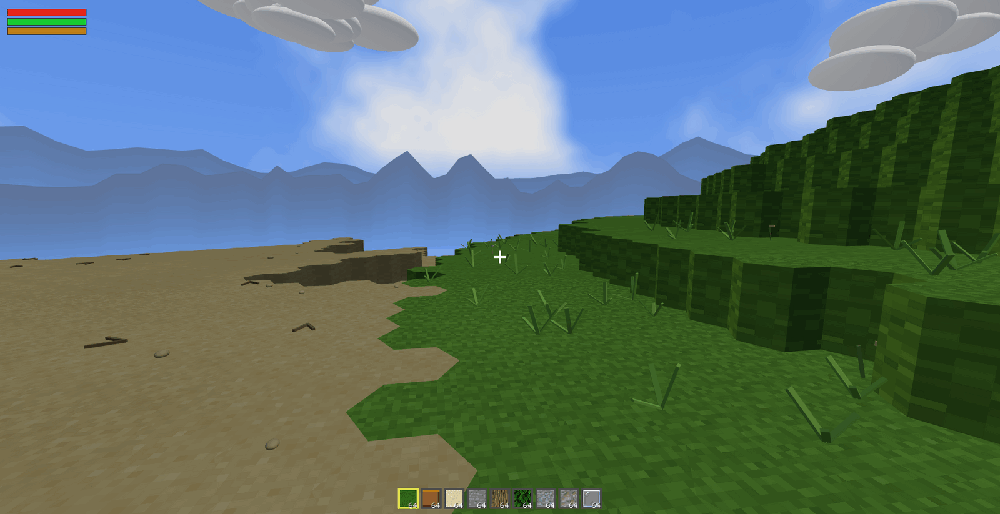
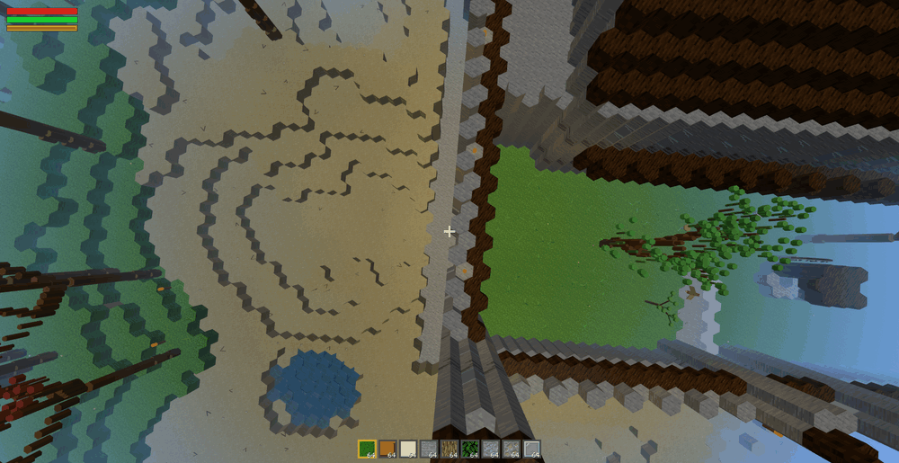
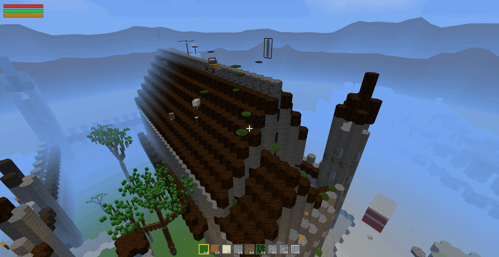
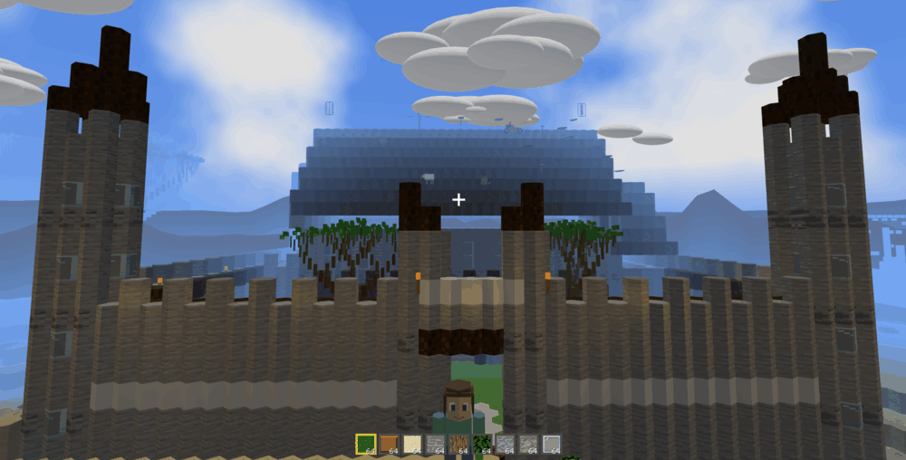
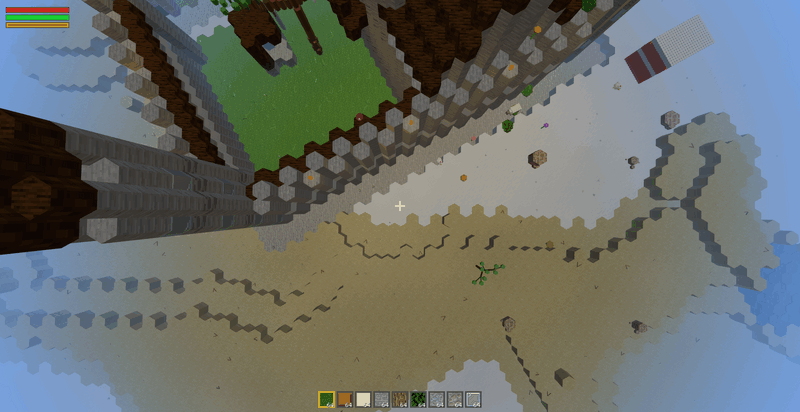
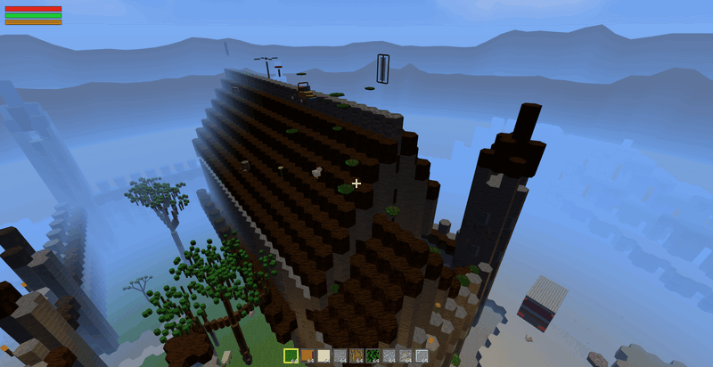
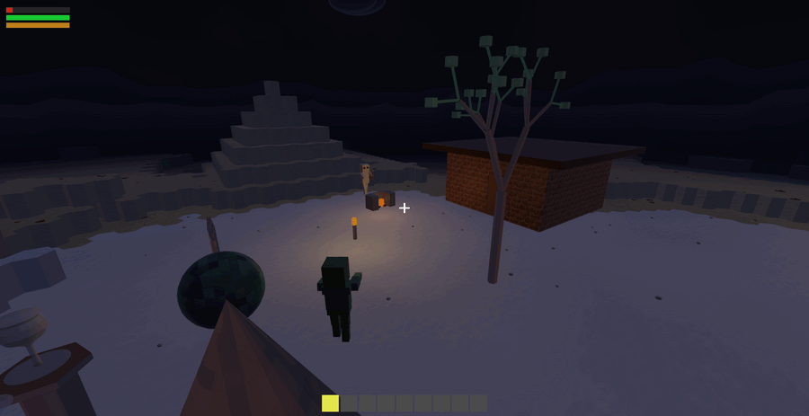
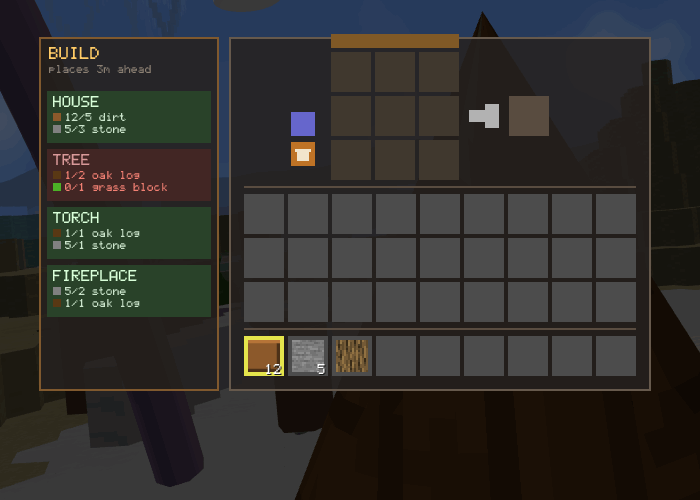
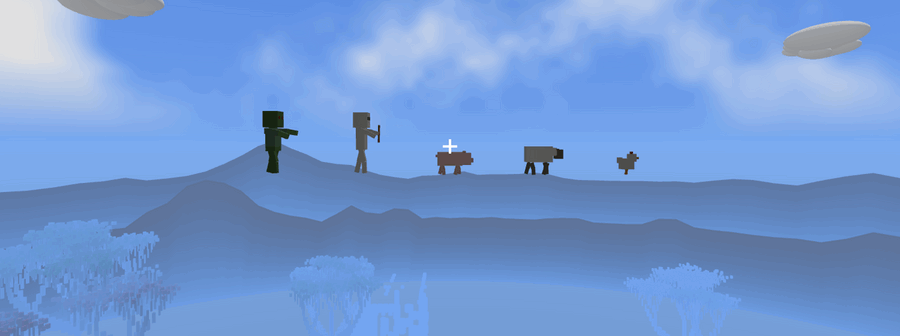
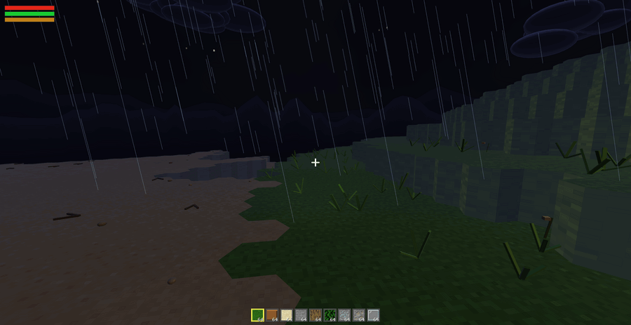

# HexaCraft

A voxel sandbox built from scratch in C++ and OpenGL 3.3 — except the voxels are
**hexagonal prisms**, not cubes. Procedurally generated terrain, a day/night cycle,
weather, mobs, an inventory with crafting, drivable vehicle, and a full Phong/Gouraud
lighting playground you can toggle apart piece by piece.

Everything is rendered with hand-written GLSL shaders. No engine, no scene graph —
just GLFW for the window, GLAD for the GL loader, GLM for math, and `stb_image` for
textures.



---

## Hexagons, not cubes

Every block is a hexagonal prism on an offset grid, which changes more than it sounds
like it should. Neighbours come in sixes instead of fours, so terrain steps and biome
boundaries scallop instead of staircasing, and water pools into hex outlines:



At eye level it reads as ordinary voxel terrain — the tiling only announces itself from
above, or along a cliff edge:



---

## What's in it

**World**
- 200 × 200 × 32 hex-prism grid, generated at startup from layered value noise
- Five biomes — sand, grass, stone, water, snow — with blended edges
- Prebuilt structures: a medieval castle, a village, a pyramid, a watchtower, a
  dungeon, and ponds
- Trees grown from a recursive fractal branch routine, then baked into per-variant
  VBOs so the forest costs one draw call per variant instead of a fractal walk per frame
- Ground scatter, wind sway on foliage, a horizon ring and drifting volumetric clouds
  past the draw distance

The castle sits at the main spawn, built into the mountainside — twin gatehouse towers,
a crenellated curtain wall, and torches burning along it:



**Rendering**
- Phong and Gouraud shading, switchable at runtime (`H`)
- Directional sun *and* a separate directional moon, point lights, a spot light —
  each independently toggleable, as are the ambient / diffuse / specular terms
- Nearest-N dynamic light selection, so torches and fireplaces light their surroundings
  without blowing the uniform budget
- Frustum + occlusion culling, uniform-location caching, 4× MSAA
- Seamless skybox cubemap, distance fog matched to render distance, deferred
  transparent water pass

Shading is switchable at runtime, which makes the difference easy to see from one spot:

| Phong (per-fragment) | Gouraud (per-vertex) |
|---|---|
|  |  |

Torches and fireplaces are real point lights, picked nearest-N per frame:



**Gameplay**
- Walk, sprint, jump, fly; health, stamina and hunger bars with fall damage and death/respawn
- Third-person, first-person and free-fly cameras, plus a 4-viewport split view
- Break and place blocks; terrain sculpt tools that raise hills and dig ponds
- 36-slot inventory with a 3×3 crafting grid, searchable recipe book, and a Build tab
  that places whole structures (house / tree / torch / fireplace) for a material cost
- Tools and weapons — swords, axes, pickaxes, shovels, a bow — with per-material mining speed
- Mobs: chickens, pigs, sheep, zombies and skeletons, each with idle/wander/chase/attack/flee states
- A drivable car with terrain-following suspension and steering
- Toggleable rain, a rotating fan, doors and windows that open

The inventory carries a 3×3 crafting grid, a searchable recipe book, and a Build tab
that costs materials out of your inventory — green when you can afford it, red when
you can't:



Mobs — chicken, pig, sheep, zombie, skeleton — each run their own state machine:



Rain at night, over the same biome boundary as the shot at the top:



---

## Running it

### Requirements

Linux with an OpenGL 3.3-capable driver, `g++`, and GLFW plus the X11 development
headers. On Debian/Ubuntu:

```bash
sudo apt install build-essential libglfw3-dev libgl1-mesa-dev xorg-dev
```

GLAD, GLM and the GLFW headers are vendored under `third_party/opengl/`, so nothing
else needs installing.

### Build and run

```bash
./run.sh
```

That's the whole thing — `run.sh` compiles and launches. It is equivalent to:

```bash
g++ -O2 -o hexacraft src/main.cpp src/glad.c \
    -Ithird_party/opengl/include \
    -lglfw -lGL -lX11 -lpthread -lXrandr -lXi -ldl -lm
./hexacraft
```

For a compile-only check without launching:

```bash
g++ -O2 -fsyntax-only src/main.cpp -Ithird_party/opengl/include
```

World generation takes a few seconds before the first frame appears. The full control
list is printed to the terminal on startup.

---

## Controls

**Movement**

| Key | Action |
|---|---|
| `W` `A` `S` `D` | Walk / strafe |
| `Space` | Jump |
| `Left Shift` | Sprint (1.5×, drains stamina) |
| `Q` (hold) | Fly up — release to fall |
| `E` / `R` | Fly up / down |

**Camera**

| Key | Action |
|---|---|
| `C` | Cycle third-person → first-person → free-fly |
| Mouse | Look around |
| `X` / `Y` / `Z` | Pitch / yaw / roll (hold `Shift` to reverse) |
| `F` | Orbit the look-at point (free-fly only) |
| `V` | Toggle 4-viewport split |
| `Ctrl` + Scroll | Zoom |

**Building and inventory**

| Key | Action |
|---|---|
| Left click | Attack mob, place block, or use the sculpt tool |
| Right click (hold) | Break block (bedrock is unbreakable) |
| Right click | Interact — on a crafting table this opens the 3×3 grid |
| Middle click | Pick the targeted block into the hotbar |
| `I` | Open / close inventory, crafting and recipe book |
| `K` | Grab or set down the targeted block |
| Scroll | Cycle hotbar slot |
| Numpad `1`–`9` | Quick-select hotbar slot |

**Lighting**

| Key | Action |
|---|---|
| `1` / `2` / `3` | Directional / point / spot lights on-off |
| `5` / `6` / `7` | Ambient / diffuse / specular on-off |
| `L` | Master light on-off |
| `H` | Gouraud ↔ Phong shading |

**World and objects**

| Key | Action |
|---|---|
| `T` | Cycle time: night → dawn → noon → dusk |
| `N` | Toggle rain |
| `G` | Toggle the rotating fan |
| `O` | Toggle door |
| `P` | Toggle windows — or respawn when dead |
| `B` | Take control of the car / hand it back |
| Arrow keys | Drive the car (up/down accelerate, left/right steer) |
| `F7` | Toggle baked tree meshes (off = live fractal, slower) |
| `Esc` | Quit |

---

## Development hooks

A handful of environment variables make renders reproducible from the command line,
which is how the before/after evidence in `docs/` was captured:

| Variable | Effect |
|---|---|
| `HEXA_SHOT=out.ppm` | Capture a frame to a PPM and exit; also prints measured FPS |
| `HEXA_SHOT_DELAY=6` | Seconds to wait before the capture (default 6) |
| `HEXA_SHOT_CAM="x,y,z,yaw,pitch"` | Drop the camera into free-fly at a fixed pose |
| `HEXA_NOVSYNC=1` | Disable vsync so frame timings aren't clamped to the refresh rate |
| `HEXA_GOURAUD=1` | Start in Gouraud shading instead of Phong |
| `HEXA_RAIN=1` | Start with rain on |
| `HEXA_DAY=0..3` | Start at night / dawn / noon / dusk |
| `HEXA_BUILD_DEMO=1` | Build one of each structure recipe on level ground and frame them |
| `HEXA_BUILD_DEMO_NIGHT=1` | Same, at night — the only way to see torch and fireplace light |
| `HEXA_BUILD_DEMO_UI=1` | Open the crafting screen on the Build tab with a partial inventory |
| `HEXA_BUILD_TEST=1` | Run the in-process build assertions and exit with the pass/fail status |

Together they make a comparison reproducible — the Phong/Gouraud pair above is two runs
of the same pose, one flag apart:

```bash
CAM="12,33,14,-140,-30"
HEXA_NOVSYNC=1 HEXA_DAY=2 HEXA_SHOT_CAM="$CAM" HEXA_SHOT=/tmp/phong.ppm   ./hexacraft
HEXA_NOVSYNC=1 HEXA_DAY=2 HEXA_SHOT_CAM="$CAM" HEXA_SHOT=/tmp/gouraud.ppm HEXA_GOURAUD=1 ./hexacraft
convert /tmp/phong.ppm -resize 800x -dither None -colors 200 docs/img/shading-phong.png
```

`HEXA_SHOT_DELAY` also doubles as a self-timer for anything that isn't scriptable: give
yourself twenty seconds, open the inventory or fly somewhere by hand, and the shutter
fires on its own.

---

## Layout

```
src/
  main.cpp        entry point, GL setup, render loop, shot/demo hooks
  globals.h       constants, block and item tables, world state
  world.h         terrain generation, biomes, structures, chunk rendering
  geometry.h      hex prism and mesh builders
  player.h        player state, physics, collision
  input.h         all input handling, mobs, car, sculpt tools, crafting actions
  hud.h           crosshair, bars, hotbar, inventory and recipe-book UI
  objects.h       fan, door, window and other interactive props
  horizon.h       horizon ring and volumetric clouds
  weather.h       rain
  skybox.h        cubemap skybox
  shaders.h       shader compile and uniform helpers
  glad.c          GL loader
  stb_image.h     texture decoding
shaders/          vertexShader.glsl, fragmentShader.glsl
assets/           block textures, skybox faces, source art
third_party/      GLAD, GLFW headers, GLM
tools/            one-off Python/C++ generators used while building the world
docs/img/         the screenshots used above
docs/             plans, feature notes, and before/after evidence captures
```
